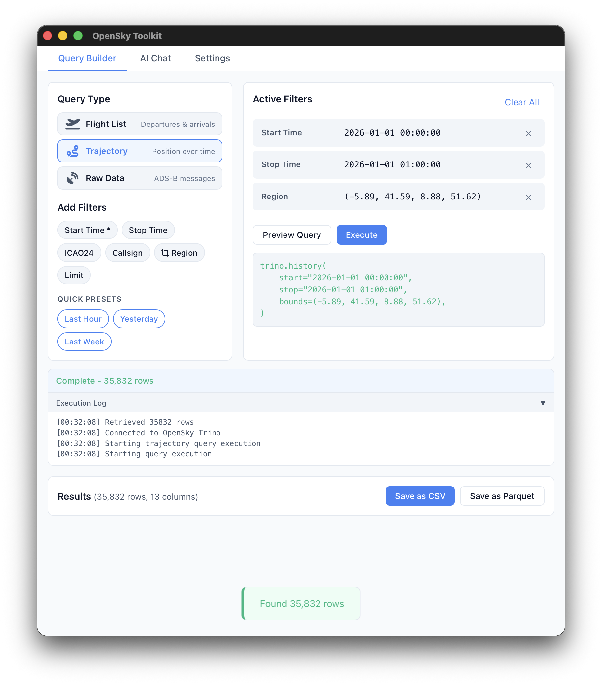
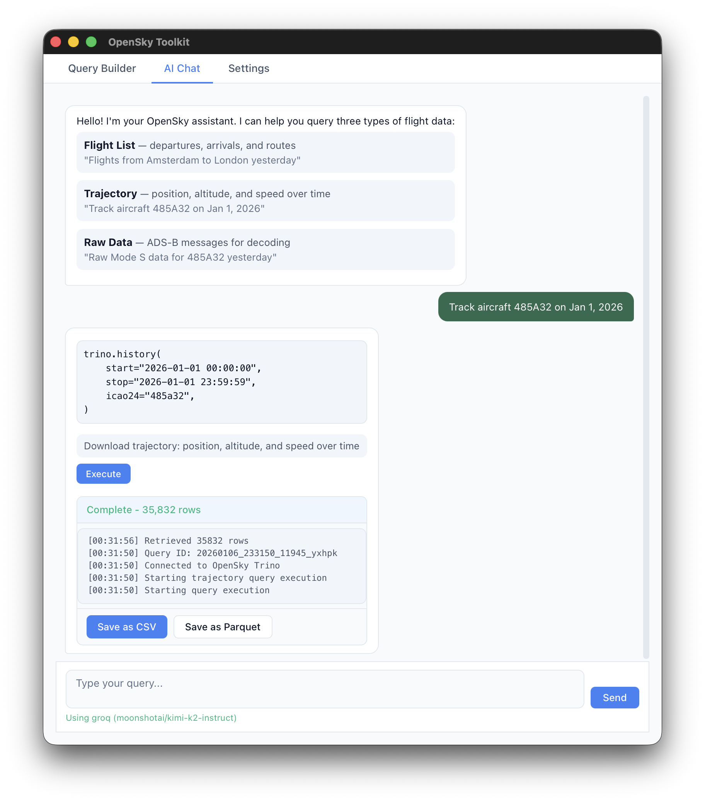

# OSTK - OpenSky Toolkit

A desktop application for querying historical flight data from the [OpenSky Network](https://opensky-network.org/) Trino database.

<p align="center">
  
  
</p>

## Features

- **Query Builder** - Visual interface for building flight data queries
  - Filter by time range, aircraft (ICAO24), callsign, airports
  - Quick presets: last hour, yesterday, last week
  - Inline editing of filter values

- **AI Chat** - Natural language interface for queries
  - Ask questions like "Flights from Amsterdam to London yesterday"
  - Powered by Groq, OpenAI, or local Ollama models
  - Automatic query generation and execution

- **Data Export** - Save results in CSV or Parquet format

## Installation

### Pre-built Binaries

Download from [GitHub Releases](https://github.com/junzis/ostk/releases):

| Platform | Download |
|----------|----------|
| Linux x64 | `ostk-linux-x64` |
| Windows x64 | `ostk-windows-x64.exe` |
| macOS Intel | `OSTK-macos-x64.app.zip` |
| macOS Apple Silicon | `OSTK-macos-arm64.app.zip` |

#### macOS Installation

The macOS app is ad-hoc signed. On first launch, you may see a security warning. To allow the app:

```bash
# Unzip and move to Applications
unzip OSTK-macos-*.app.zip
mv OSTK.app /Applications/

# Remove quarantine attribute
xattr -cr /Applications/OSTK.app
```

Or: Right-click the app → Open → Click "Open" in the dialog.

#### Linux Installation

```bash
# Make executable and run
chmod +x ostk-linux-x64
./ostk-linux-x64
```

**Required dependencies:**
```bash
# Debian/Ubuntu
sudo apt install libwebkit2gtk-4.1-0

# Arch Linux
sudo pacman -S webkit2gtk-4.1
```

### Build from Source

Requirements:
- Rust 1.70+
- System dependencies (Linux only):
  ```bash
  sudo apt install libwebkit2gtk-4.1-dev libappindicator3-dev librsvg2-dev
  ```

Build:
```bash
git clone https://github.com/junzis/ostk
cd ostk/ostk-rs
cargo build --release
```

Run:
```bash
cargo run --release
```

## Configuration

### OpenSky Credentials

1. Create an account at [OpenSky Network](https://opensky-network.org/)
2. Go to Settings → OpenSky Credentials
3. Enter your username and password

### LLM Provider (for AI Chat)

Choose one of the following:

**Groq (Recommended - Free)**
1. Get a free API key at [console.groq.com](https://console.groq.com)
2. Go to Settings → LLM Provider → Groq
3. Enter your API key and click "Fetch" to load available models

**OpenAI**
1. Get an API key at [platform.openai.com](https://platform.openai.com)
2. Select OpenAI as provider and enter your key

**Ollama (Local)**
1. Install [Ollama](https://ollama.ai/)
2. Pull a model: `ollama pull llama3.1:8b`
3. Select Ollama as provider

## Usage

### Query Builder

1. Click filter chips to add filters (Start Time, ICAO24, etc.)
2. Edit values inline by clicking on them
3. Use presets for quick time ranges
4. Click "Preview Query" to see the generated query
5. Click "Execute" to run the query
6. Export results as CSV or Parquet

### AI Chat

1. Configure an LLM provider in Settings
2. Type natural language queries:
   - "Flights from EHAM to EGLL yesterday"
   - "Get trajectory for aircraft 485A32 on Nov 8, 2025"
   - "All departures from Frankfurt in the last 3 hours"
3. Click "Execute" on generated queries

## Project Structure

```
ostk-rs/
├── src/
│   ├── main.rs          # Application entry point
│   ├── commands.rs      # Tauri commands (backend API)
│   ├── agent.rs         # LLM agent for query parsing
│   ├── config.rs        # Configuration management
│   ├── state.rs         # Application state
│   └── llm/             # LLM provider implementations
│       ├── mod.rs
│       └── groq.rs
├── web/                 # Frontend (HTML/CSS/JS)
│   ├── index.html
│   ├── css/style.css
│   └── js/app.js
├── resources/
│   └── agent.md         # LLM system prompt
└── tauri.conf.json      # Tauri configuration
```

## Dependencies

- [opensky](../opensky-rs) - Rust client for OpenSky Trino database
- [Tauri](https://tauri.app/) - Desktop app framework
- [tokio](https://tokio.rs/) - Async runtime

## License

MIT License - see [LICENSE](LICENSE) for details.

## Related Projects

- [opensky](../opensky-rs) - Rust library for OpenSky Network
- [pyopensky](https://github.com/open-aviation/pyopensky) - Python library for OpenSky Network
- [traffic](https://github.com/xoolive/traffic) - Air traffic data analysis library
