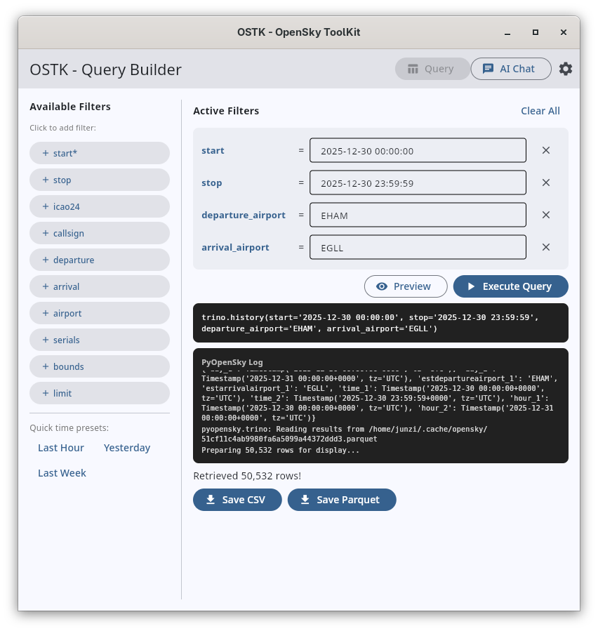
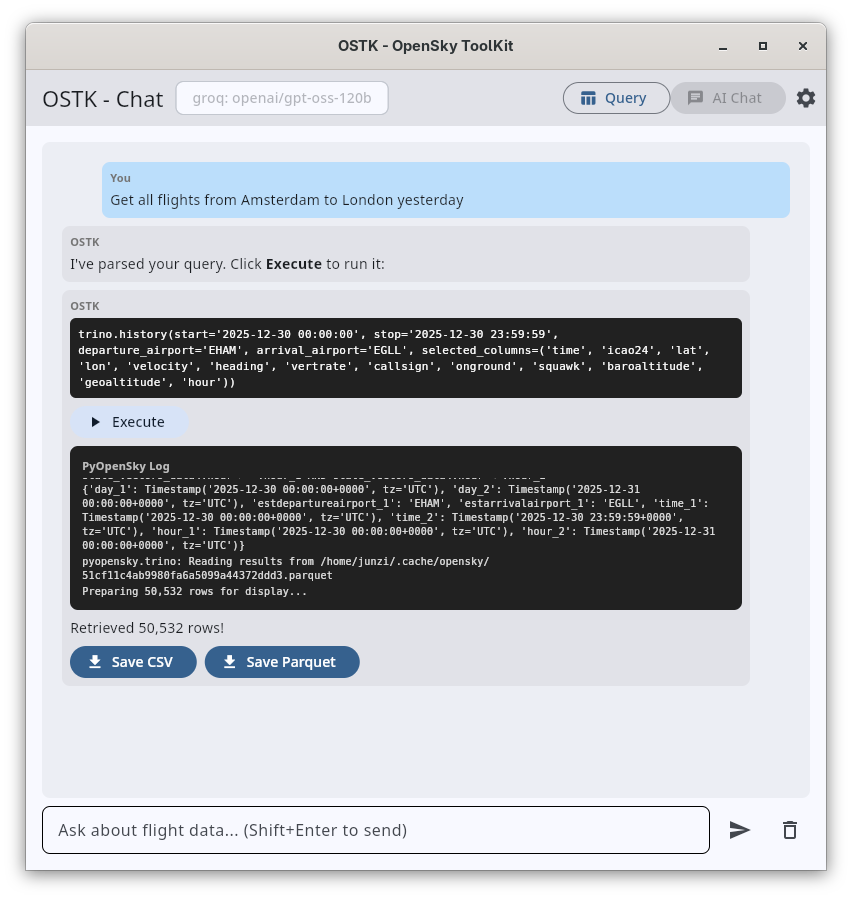
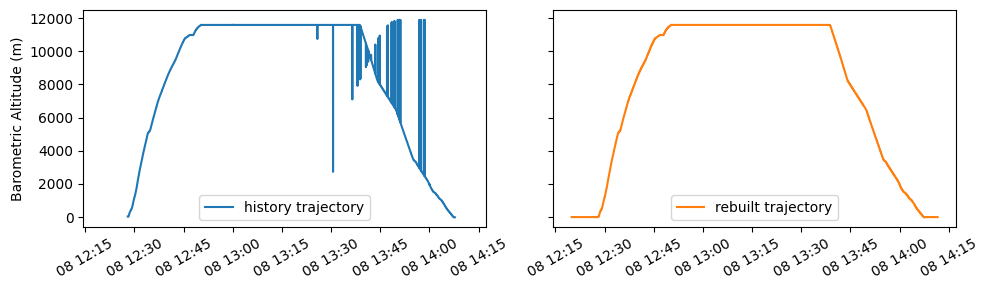

# OSTK - Nifty OpenSky tools with good vibes

**OSTK (OpenSky ToolKit)** is a desktop application and Python library for working with OpenSky Network ADS-B data. It features an intuitive GUI for building queries, an LLM-powered chat assistant, and advanced trajectory reconstruction with enhanced CPR decoding.

## ✨ Features

- **🖥️ Desktop GUI** - Visual query builder with real-time results
- **🤖 AI Chat Assistant** - Natural language queries powered by LLM
- **📡 Trajectory Reconstruction** - Enhanced accuracy through raw CPR decoding
- **⚡ CLI Tools** - Full command-line interface for automation
- **🐍 Python API** - Integrate directly into your scripts

| Query Builder | AI Chat |
|---------------|---------|
|  |  |

## 📦 Installation

Run directly with [uv](https://docs.astral.sh/uv/):

```sh
uv run ostk
```

Or install via pip:

```sh
pip install ostk
ostk
```

Or with [pipx](https://pipx.pypa.io/) for isolated installation:

```sh
pipx install ostk
ostk
```

### 📥 Standalone Downloads

Alternatively, download a standalone binary (no Python required):

| Platform | Download |
|----------|----------|
| Windows | [ostk-windows.exe](https://github.com/junzis/ostk/releases/latest) |
| macOS (Apple Silicon) | [ostk-macos-apple-silicon](https://github.com/junzis/ostk/releases/latest) |
| macOS (Intel) | [ostk-macos-intel](https://github.com/junzis/ostk/releases/latest) |
| Linux | [ostk-linux.AppImage](https://github.com/junzis/ostk/releases/latest) |

<details>
<summary>Platform-specific instructions</summary>

**macOS**: If you see a security warning, right-click the file and select "Open", or run:
```sh
xattr -cr ostk-macos-apple-silicon  # or ostk-macos-intel
chmod +x ostk-macos-apple-silicon
```

**Linux**: Make the AppImage executable and run:
```sh
chmod +x ostk-linux.AppImage
./ostk-linux.AppImage
```

</details>

## 🚀 Quick Start

### GUI Application

Launch the GUI by running `ostk` without arguments:

```sh
ostk
```

Or download the standalone app from the [releases page](https://github.com/junzis/ostk/releases).

### Command Line

```sh
# Rebuild trajectory from raw ADS-B messages
ostk trajectory rebuild --icao24 485A32 --start "2025-11-08 12:00:00" --stop "2025-11-08 15:00:00"

# Download historical trajectory data
ostk trajectory history --start "2025-11-08 12:00:00" --stop "2025-11-08 15:00:00" --icao24 485A32

# Start the LLM agent (CLI mode)
ostk agent start
```

### Python API

```python
from ostk import rebuild

# Rebuild trajectory from raw ADS-B messages
df = rebuild(
    icao24="485A32",
    start="2025-11-08 12:00:00",
    stop="2025-11-08 15:00:00"
)
```

```python
from ostk import Agent

# Use the LLM agent
agent = Agent()
params = agent.parse_query(
    "Flights from Amsterdam to London on Nov 8, 2025 between 13:00 and 15:00"
)
df = agent.execute_query(params)
```

## ⚙️ Configuration

### OpenSky Credentials

Configure your OpenSky Network credentials (required for data access):

```sh
ostk pyopensky config set
```

### LLM Agent Setup

Configure your LLM provider for the AI assistant:

```sh
# Interactive setup wizard
ostk agent config

# Or set provider directly
ostk agent config set-provider groq  # groq, openai, or ollama
ostk agent config set-key --provider groq
```

Supported providers:
- **Groq** - Fast inference with free tier (recommended)
- **OpenAI** - GPT-4, GPT-3.5
- **Ollama** - Local models, no API key needed

Config file locations:
- Linux/macOS: `~/.config/ostk/settings.conf`
- Windows: `%LOCALAPPDATA%\ostk\settings.conf`

## 🔧 How Trajectory Rebuild Works

The `rebuild()` function reconstructs trajectories by:

1. Querying raw position and velocity messages from OpenSky's database
2. Pairing odd and even CPR frames for accurate global position decoding
3. Validating positions with reference points to filter outliers
4. Merging position and velocity data with temporal alignment

**When to use `rebuild()` vs `pyopensky.trino.history()`:**

| Feature | rebuild() | history() |
|---------|-----------|-----------|
| Accuracy | Higher (raw CPR decoding) | Standard (pre-computed) |
| Outliers | Fewer (with validation) | More common |
| Speed | Slower (decoding overhead) | Faster (direct query) |
| Filtering | icao24 + time only | Full filtering support |

Use `history()` for faster queries with complex filtering. Use `rebuild()` for maximum accuracy and fewer outliers.



## 📚 Documentation

- **[CLI Reference](docs/cli.md)** - Detailed command-line usage
- **[Python API](docs/api.md)** - Complete API documentation
- **[Examples](docs/examples.md)** - Usage examples and comparisons
- **[Agent Guide](docs/agent.md)** - LLM agent usage

## 👤 Authors

- Junzi Sun (j.sun-1@tudelft.nl)

## 🔗 Related Projects

- [pyopensky](https://github.com/open-aviation/pyopensky/) - Python interface for OpenSky Network data
- [pyModeS](https://github.com/junzis/pyModeS) - ADS-B and Mode S message decoder

## 📄 License

MIT License
